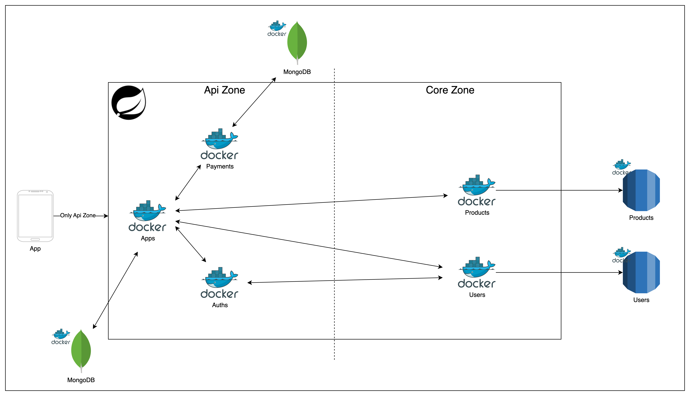

# 실행 방법
프로젝트 최 상단에 start.sh를 실행합니다.

/bin/bash ./start.sh

# 개발환경

- JAVA 17
- Gradle 8.10.2
- Spring Boot 3.2.1
    - spring dependency management 1.1.4
    - spring-data-mongodb
    - spring-data-jpa
    - spring-data-redis
    - spring-kafka
- MariaDB 11.5.2
- MongoDB 5.0.2
- Kafka 3.7
- Redis
- docker-compose.yaml
    - mongodb
    - mariadb
    - kafka
    - redis
    - Application Spring Boot/JDK 17

# MSA BFF(Backend For Frontend) 구조

- Api Domain
    - 외부(APP)와 통신
    - 내부 Core MSA와 통신
- Core Domain
    - 내부 Store(Rds, Redis)들과 통신하는 도메인
    - Api Domain의 서비스들과 통신
    - 외부 통신 불가
        - local에서는 외부통신도 되지만 AWS 등 서버에 올릴 때는 의도적으로 통신 불가 가능
- Worker Domain
    - Kafka Consumer
  

## Hexagonal Architecture 적용
모든 MSA 도메인은 Hexagonal Architecture에 기반하여 Package 구조및 의존성 개발
  

## Hexagonal Architecture 의존성 역전의 법칙 적용
- 외부에서 내부 layer 접근을 허용
- 내부에서 외부 layer 접근을 허용하지 않음
  - 따라서 Domain → Infrasture을 사용하여, Kafka, RDS, Redis 등 접근을 위해 “의존성 역전의 법칙” 사용
  

- 예시 1) FeignClient: 의존성 역전의 법칙에 의한 Infrastructure FeignClient 접근하도록 구현됨
  

- 예시 2) JPA: 의존성 역전의 법칙에 의한 Infrastructure RDS 접근
  

- 예시3) 결제 모듈: 의존성 역전의 법칙에 의한 Infrastructure TossPayments 접근
  

- 또한 의존성 역전의 법칙 구현으로 “기능, lib, 미들웨어” Adapting 가능
  - 예시 1) Feign Client(실 개발) → Web Client 라이브러리 교체
  - 그림은 Apdater, Client를 같이 교체하는 듯 그렸지만 “상황에 따라 Client만 교체”로도 가능
  
  
  - 예시 2) JPA(실 개발) → Mybatis 라이브러리 교체
  

  - 예시 3) 결제 모듈 교체
  - 그림은 Apdater, Client를 같이 교체하는 듯 그렸지만 “상황에 따라 Client만 교체”로도 가능
  

# 조회수 증가 플로우
- 대용량 처리 For Kafka
- Redisson 분산락으로 RDS에 원자성 보장하여 조회수 증가시켜 저장
  

# 결제 플로우
- Redisson 분산락으로 RDS에 결제후 포인트를 저장
  

# 페이지 네이션 Swagger

- 모든 api는 apps 도메인에서 시작이기 때문에 아래 swagger로 들어가서 모든 기능 test 가능합니다.
- http://localhost:8000/swagger-ui/index.html#/member-controller/findAll
- 검색어: name = 조용석
- sort: 생성일 desc, 조회수 desc, 이름 asc
  
