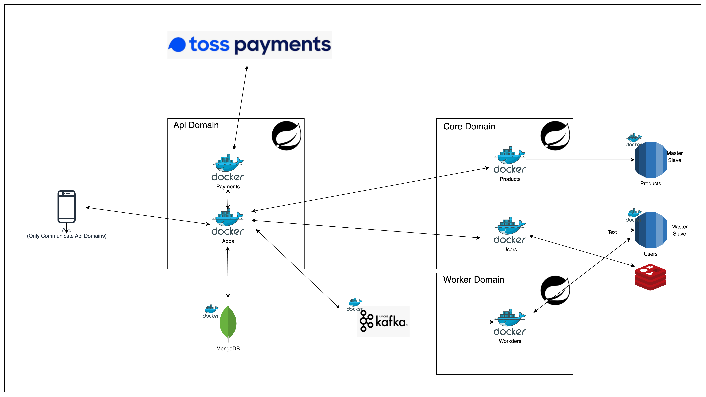

# 실행 방법
프로젝트 최 상단에 start.sh를 실행합니다.

/bin/bash ./start.sh

# 개발환경

- JAVA 17
- Gradle 8.10.2
- Spring Boot 3.2.1
    - spring dependency management 1.1.4
    - spring-data-mongodb
    - spring-data-jap
    - spring-data-redis
    - spring-kafka
- JUnit 5
- MariaDB 11.5.2
- MongoDB 5.0.2
- Kafka 3.7
- Redis
- docker-compose.yaml
    - mongodb
    - mariadb
    - kafka
    - redis
    - Application Spring Boot/JDK 17

# MSA BFF(Backend For Frontend) 구조

- Api Domain
    - 외부(APP)와 통신
    - 내부 Core MSA와 통신
- Core Domain
    - 내부 Store(Rds, Redis)들과 통신하는 도메인
    - Api Domain의 서비스들과 통신
    - 외부 통신 불가
        - local에서는 외부통신도 되지만 AWS 등 서버에 올릴 때는 의도적으로 통신 불가 가능
- Worker Domain
    - Kafka Consumer
  

## Hexagonal Architecture 적용
모든 MSA 도메인은 Hexagonal Architecture에 기반하여 Package 구조및 의존성 개발
  

## Hexagonal Architecture 의존성 역전의 법칙 적용
- 외부에서 내부 layer 접근을 허용
- 내부에서 외부 layer 접근을 허용하지 않음
  - 따라서 의존성 역전의 법칙으로 Infrastructure를 통해 외부 assets 접근을 적용
  - 1. FeignClient: 의존성 역전의 법칙에 의한 Infrastructure FeignClient 접근
  

  - 2. JPA: 의존성 역전의 법칙에 의한 Infrastructure RDS 접근
  

  - 3. 의존성 역전의 법칙을 기반으로 "원하는 기능, lib, 미들웨어 등 변경" 가능
  
  

